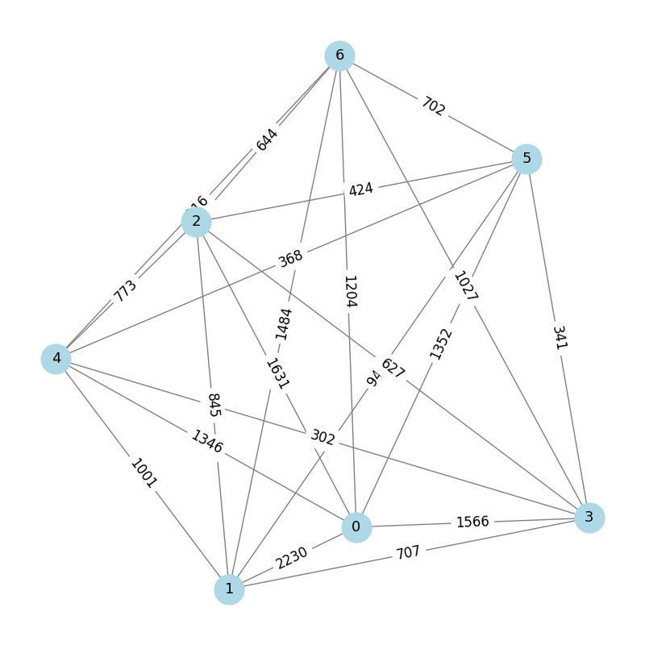
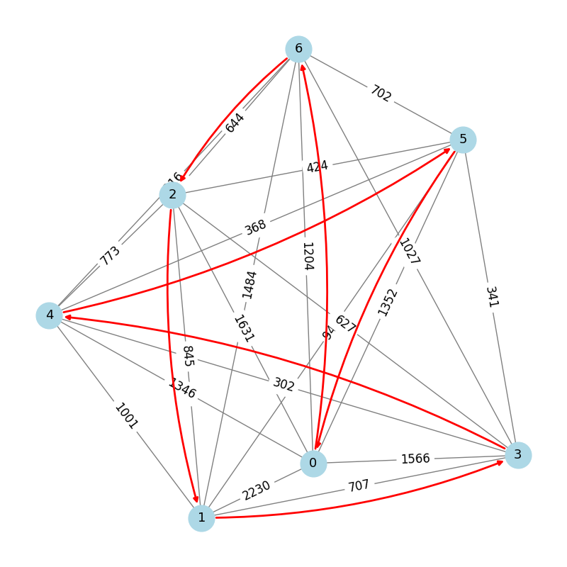
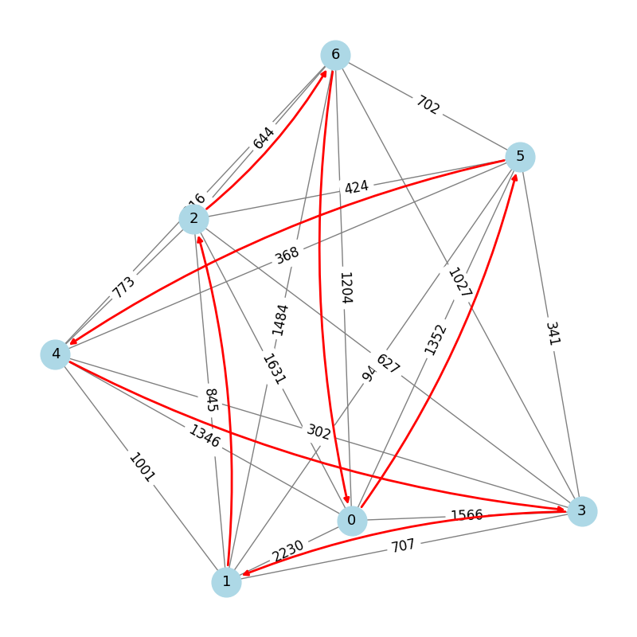
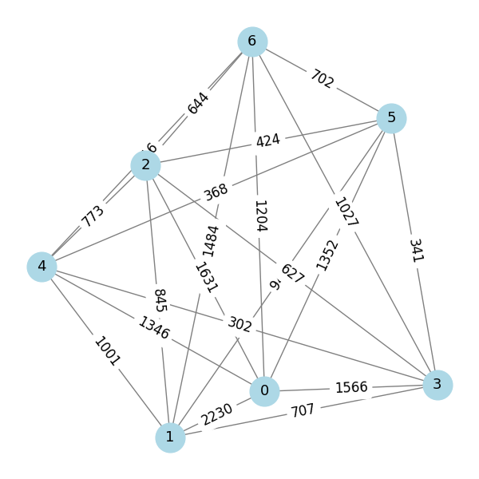
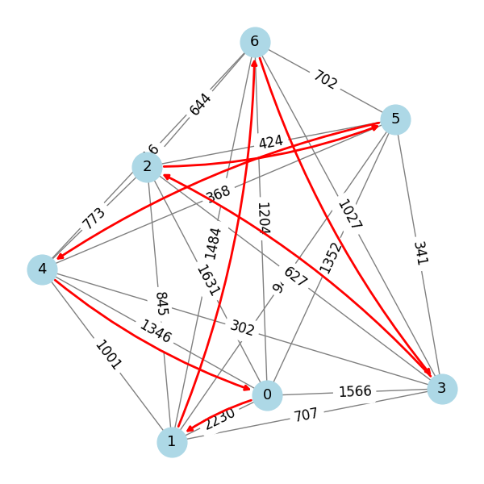
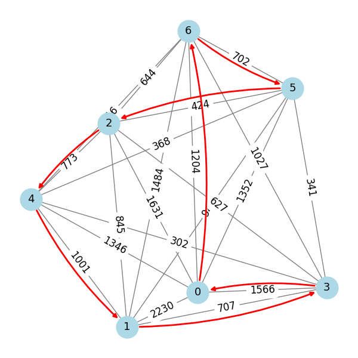

This file contains the output of my solution for the "Travelling Salesperson" problem.

# Traveling Salesperson

A traveling salesperson has a list of seven cities to visit exactly once during their route. The salesperson wants to take the shortest route possible.

This problem contains two exercises which illustrate the difference between the hybrid and classical solvers.

## Exercise 1

The program ``hss_exercise.py`` is the first exercise. You will need to:

 1. Call the hybrid solver
 2. Call the traveling salesperson QUBO generator from ``dwave_networkx``
 3. Fill in the ``get-qubo`` function
 4. Setup your sampler in the ``get_sampler`` function to run on the hybrid sampler

 Notes: 
 
1. Don't forget to import the packages where the sampler and traveling salesperson QUBO generator lives.
2. You may find the [Ocean documentation](https://docs.ocean.dwavesys.com/en/stable/) useful.

## Solution ``hss_exercise_solution.py``
The output is as follows:

---
Route:  [4, 5, 0, 6, 2, 1, 3]

Cost:  5422.0

---

#### Original

#### Route

An alternate output is as follows:

---
Route:  [6, 0, 5, 4, 3, 1, 2]

Cost:  5422.0

---

#### Route

## Exercise 2 

The second exercise is ``compare_solver_exercise.py``. This file is identical to the hss_exercise.py, except you will call a classical solver instead of a hybrid solver. 
There are two things you should modify from what you did in exercise 1: 

1. Call an alternative sampler (choose ``SimulatedAnnealingSampler``)
2. Set up your sampler in the ``get_sampler`` function to run the simulated annealing algorithm.

## Solution ``compare_solver_exercise_solution.py``
The output is as follows:

---
Route:  [6, 3, 2, 5, 4, 0, 1]

Cost:  7506.0

---

#### Original

#### Route

An alternate output is as follows:

---
Route:  [2, 4, 1, 3, 0, 6, 5]

Cost:  6377.0

---

#### Route

## License

Released under the Apache License 2.0. See [LICENSE](LICENSE) file.

